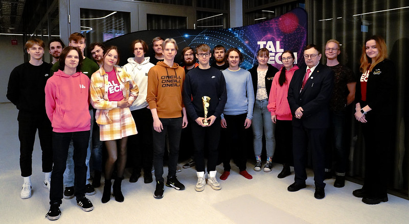
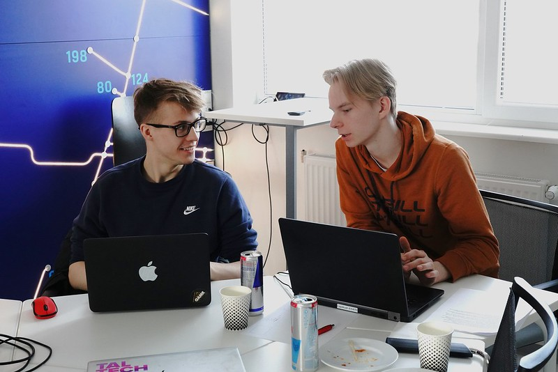
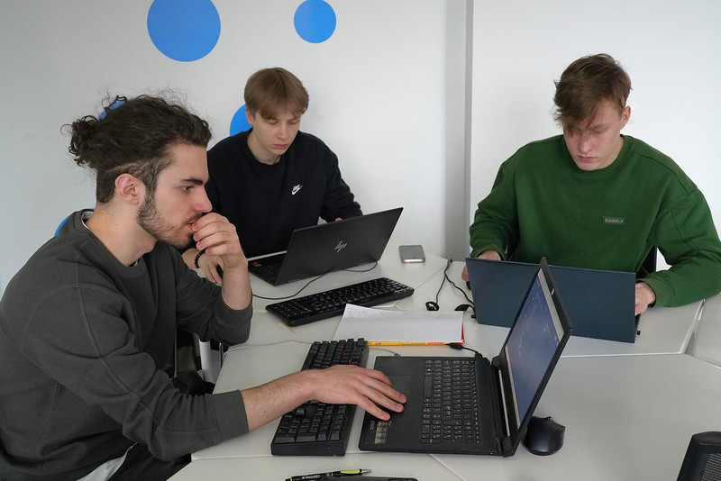
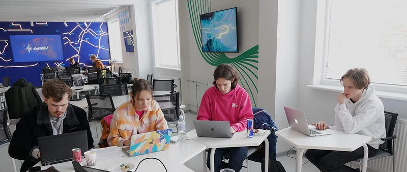

Talvel toimus iga-aastane Lapikute korraldatav programmeerimisvõistlus ASI Karikas

Möödunud talve jooksul toimus tarkvaraarenduse klubi Lapikud ja Tallinna Tehnikaülikooli Arvutisüsteemide
Instituudi
koostöös korraldatud programmeerimisvõistlus ASI Karikas, mis on juba mitmendat aastat kutsunud kooliõpilasi üle
Eesti
võistu programmeerima.

Mitu aastat on Lapikute korraldatud üritustest olnud ASI Karikas neist üks kõige suuremaid. Lapikute eesmärgiks
        on
        olnud võistluse raames kutsuda põhi- ja keskkoolis õppivaid tarkvarahuvilisi ja innukaid programmeerijaid
        koostöös
        nuputama ja mõõtu võtma. Aastate jooksul on võistlusel osalenud õpilasi mitmest Eesti koolist, sealhulgas
        Tallinna
        Tehnikagümnaasiumist, Tallinna Reaalkoolist, Tartu Tamme Gümnaasiumist ja Tartu Jaan Poska Gümnaasiumist.

Võistlus koosneb kahest voorust. Esimeses voorus töötavad õpilased koos kasvõi enda kodust, et etteantud
        nõuetele
        realiseerida teatud programm. Võistkondadest kaks parimat pääsevad edasi võistluse lõppvooru, kus ühineb
        võistlustulle ka Tehnikaülikooli enda välja pandud etalontiim, mis koosneb ülikooli tudengitest. Võistluse
        lõppvoorus osalenutel loetakse sooritatuks kaks olulist ainet TTÜ inseneeria õppekavas ja neile kingitakse
        ülikooli
        õppejõudude Margus Kruusi ja Harri Lenseni kirjutatud diskreetse matemaatika õpik.

  

Võistluse finaalvoorus osalenud tiimid. Vasakult paremale: Miina Härma Gümnaasiumi, Tallinna Ühisgümnaasiumi ja
        etalonvõistkond.

Tänavu, 18. märtsil Tallinna Tehnikaülikooli Mektory majas toimunud võistluse lõppvoorus kohtusid Tallinna
        Ühisgümnaasiumi
        ja Tartu Miina Härma Gümnaasiumi õpilased, kellest viimased pälvisid võistluse võitjate tiitli ja kelle tulemus
        oli
        märgatavalt üle nii Ühisgümnaasiumi esindajate kui ka etalontiimi liikmete omast. Pärast lõppvooru lubasid
        Lapikud, et järgmisel aastal saadetakse TTÜ poolt lõppvooru võistkond, kes on eelnevalt end paremini ette
        valmistanud
        ja suudavad teha võistluse veel pingelisemaks ja kaasahaaravamaks.

Võistlust ASI Karikas korraldavad MTÜ Lapikud ja Tallinna Tehnikaülikooli Arvutisüsteemide Instituut, sel aastal
        olid võistluse ASI Karikas peatoetajad TTÜ Akadeemiline Ametiliit ja Mektory. Läbi aastate on võistlust
        sponsoreerinud ka Mektory, Zone, Erply, CGI, Baskin Robbins ja teised austatud ettevõtted.